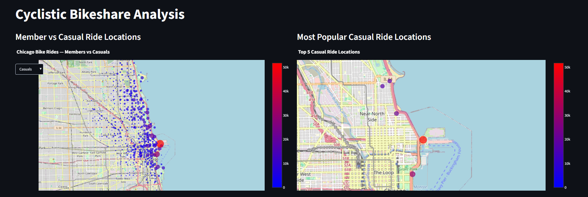
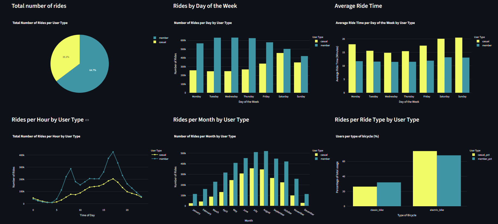
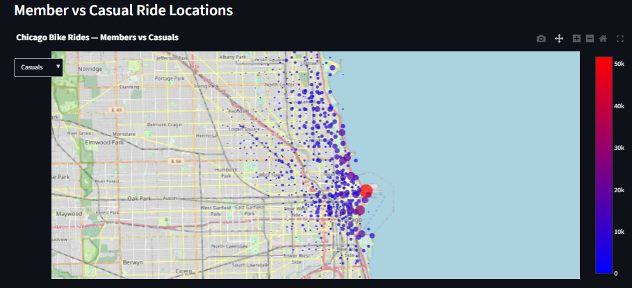
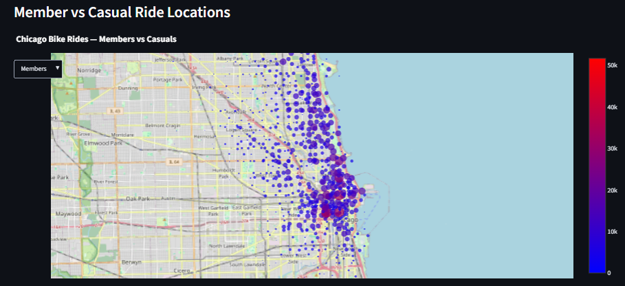
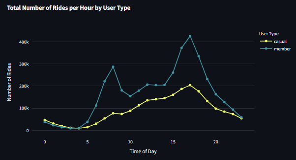

# Cyclistic Bike-Share Data Analysis

An exploratory analysis of bike share usage from the fictional Cyclistic bike-share company, comparing the differences between casual users and annual members.

## Overview

This project aims to identify differences in how casual users and annual members use the bike-share system.

The analysis explores patterns in:
- weekly and monthly usage
- time of day
- bicycle type
- length of rides
- ride starting locations

The goal of the analysis is to identify ways that casual users and annual members differ, so as to gain insights into how to convert more casual users into annual members.

## Data

While Cyclistic is a fictional company created as part of the Google Data Analysis course on Coursera, this analysis uses real data from the Divvy bike-share company in Chicago.
The data used is available here: https://divvy-tripdata.s3.amazonaws.com/index.html
This data has been made available for public use under the following license: https://divvybikes.com/data-license-agreement

The data contains information about individual bike trips, including start and end times, bicycle type, geographic location and membership status.

## Tools used

The following tools and technologies were used in the course of this analysis:
- Excel
- Python
    - Pandas
    - Plotly
- Streamlit
- Git & Github

## Data Preparation

The data from September 2025 to August 2026 was collated and combined into a single dataframe.

Each ride has a unique Ride ID. Duplicate ride IDs were checked for and removed.

Additional columns were created to show:
- start and end times converted to datetime format
- the month each ride took place
- the day each ride took place
- the hour of day each ride began
- the total time of each ride in seconds - this was later converted to minutes for ease of readability.

During a test viewing of a sample of the data in Excel, a number of classic bike rides were found to be 25 hours long. The end station name of all rides identified were listed as null values. Further investigation revealed that classic Cyclistic bikes must be left at a registered bike station at the end of a ride, as such these 25 hour rides were deemed anomalous, and classic bike rides with no listed end station name were filtered out of the dataframe.

Months and days of the week were arranged in order.
- This data collection began in September 2025, however the months were ordered in the standard January - December format for ease of trend visibility during visualisation.

## Analysis

Aiming to identify behavioural differences in casual users and annual Cyclistic members, this analysis explores several key questions:
- How does usage vary throughout the week?
    - Usage per day of the week
    - Average ride time per day of the week
- How does usage vary throughout the year?
- Do casual users and members use Cyclistic at different times of day?
- Does ride type preference vary between casual users and members?
- Is there a difference in ride start location between target groups?
    - What are the most popular ride start coordinates for casual users?
- The total number of members and casual users was also investigated.

To answer these key questions, a number of visualisations were created using Plotly.

# Key Findings

This analysis found a number of differences in casual user and member behaviour:

- Casual usage peaks on Saturdays, while member usage remains consistant Monday to Friday, before dropping off on the weekend.
- Casual users tend to favour longer rides. They increase in length during weekends, while member rides remain constant in length.
- Both groups peak in usage during the summer months, however casual usage experiences a sharp drom off while member usage decreases more gradually through Autumn.
- Cyclistic members initiate rides at two peak times - 8am and 5pm, with a sharp drop off before, between and after these periods. Casual usage increases gradually throughout the day, before peaking at 5pm.
- While there was no standout location where members initiated rides, there was increased usage in and around Chcago City Center. Casual usage was heavily weighted towards coastal tourist locations. The top 5 casual ride locations were all within the vicinity of popular parks in Chicago.
- Cyclistic members slightly favour classic bikes, while casual users slightly favour electric bikes.
- Members account for the majority of Cyclistic rides.

The key takeaway from these findings is that annual members use Cyclistic consistently, predominantly around the two traditional daily rush hour periods. This, plus the geographical data being spread around the city but weighted towards the city center hints at members using Cyclistic mainly as a convenient way to commute to and from their workplace.
Conversely, Casual usage is more centered around longer rides in the afternoon/evening and on weekends. There is a particular focus on Chicago's coastal green spaces, suggesting that leisure and tourism may be the main driving factor for these users.

# Visualisations

The visualisations created for this analysis are available as an interactive Streamlit dashboard at the link below:

INSERT LINK HERE

## Preview

## Highlights

Notable visualisations include maps showing the contrast between member and casual user ride starting locations.

        

The contrast in ride usage per hour between the two groups is also a highlight.

